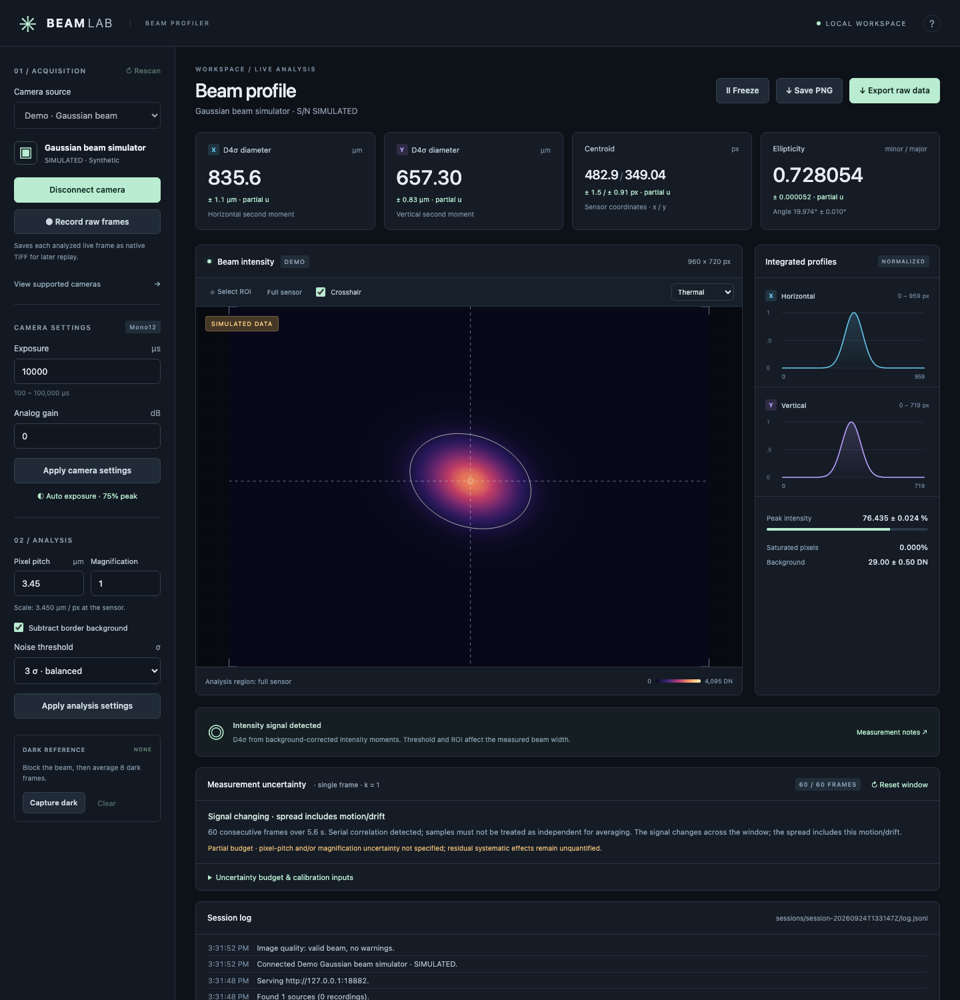
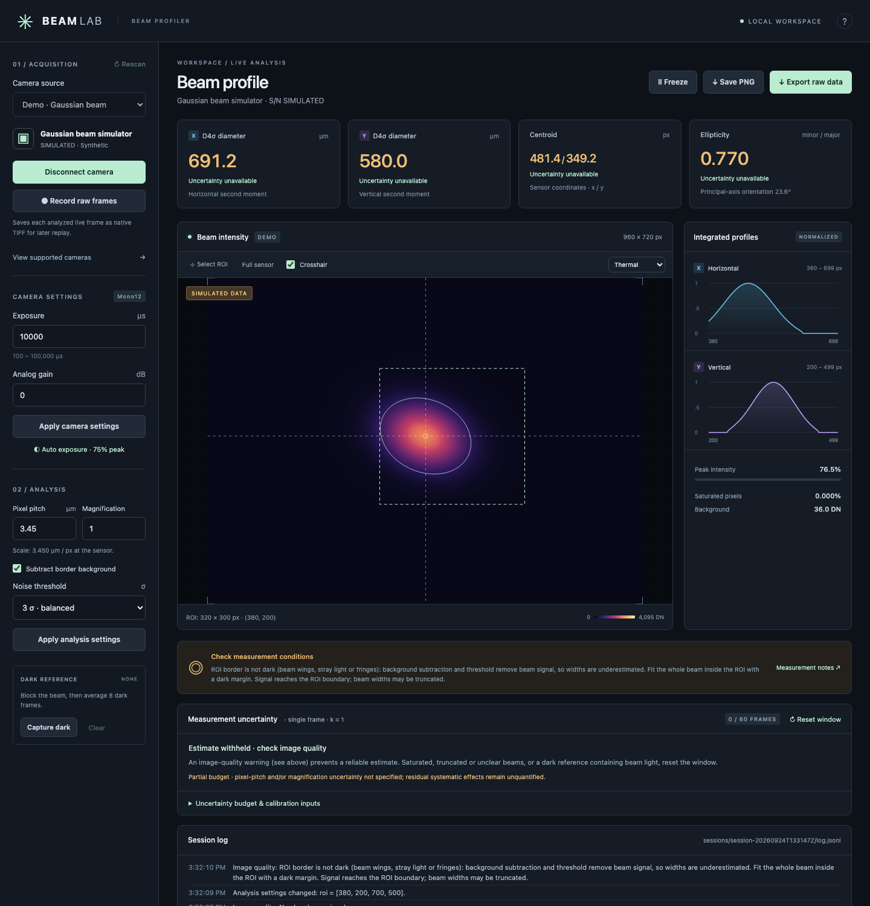
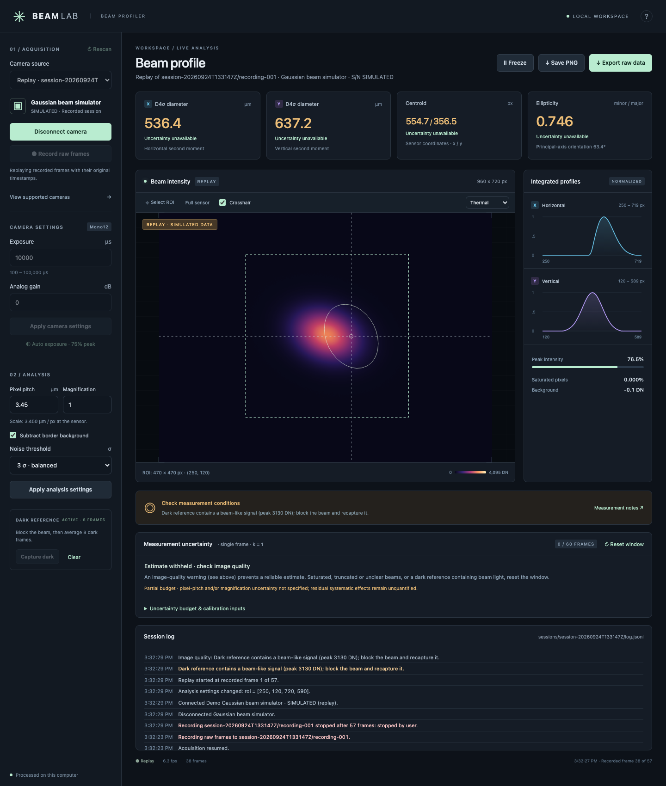
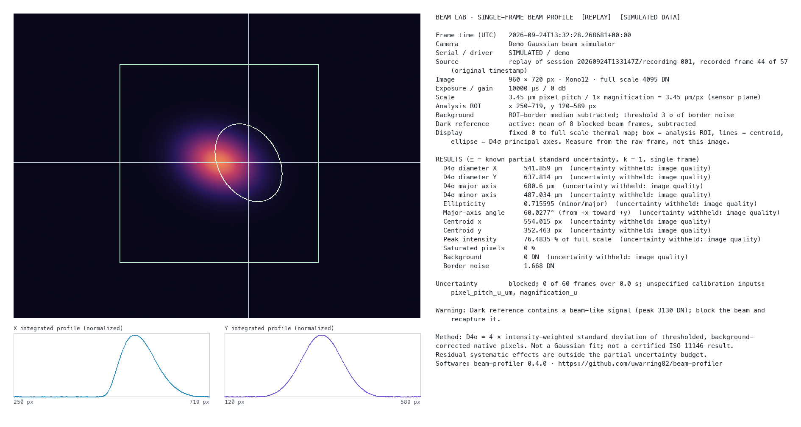

# Beam Lab

[Session log & replay](#session-log-and-replay) · [Export format](#export-format) · [Uncertainty model](docs/uncertainty.md) · [Development logbook](docs/logbook.md) · [Citation](CITATION.cff) · [MIT license](LICENSE)

[](https://github.com/uwarring82/beam-profiler/actions/workflows/test.yml)

A local laser beam profiler with a browser UI and Python camera acquisition. Built and hardware-tested on an Apple Silicon Mac with a **FLIR Firefly FFY-U3-16S2M-DL**, serial **20415440**. A built-in Gaussian beam simulator runs without any camera.

## Screenshots

Recorded with the built-in simulator ([all states](docs/images/)):

| Live measurement with uncertainty | Truncating ROI flagged |
| --- | --- |
|  |  |
| **Replay of a recording** | **Inspection PNG (Save PNG)** |
|  |  |

Further states: [offline](docs/images/01-offline.png), [warm-up](docs/images/02-warming-up.png), [saturated](docs/images/04-saturated.png), [ROI without beam](docs/images/05-roi-no-beam.png), [dark reference containing beam light](docs/images/07-frozen-dark-roi.png), [recording](docs/images/08-recording.png).

## Install

Python 3.11+ is required:

```sh
python3 -m venv .venv
source .venv/bin/activate
python -m pip install .           # or: python -m pip install -r requirements.txt
brew install aravis               # macOS; on Linux install your distribution's Aravis 0.8 runtime
```

Aravis is needed only for real cameras. It is discovered under `.vendor/aravis/*/lib`, Homebrew, or the system library path. Set `ARAVIS_LIBRARY` to an explicit library path if needed. On Apple Silicon macOS 26+, `scripts/setup_aravis_local.py` can instead place a checksum-verified Homebrew bottle in the project-local `.vendor/` directory, which is excluded from version control. Camera USB access must be allowed by the host operating system; sandboxed processes may discover no cameras even when USB hardware is attached.

## Run

```sh
python -m beam_profiler.server    # or: beam-profiler
```

Open **http://127.0.0.1:8877**, select the FLIR camera, and click **Connect camera**. Close other camera applications first. Use `--port 8878` if the port is busy. Stop with Ctrl-C to release the camera.

To reopen a previously exported frame, its camera settings and dark reference, use `python3 -m beam_profiler.server --restore-snapshot path/to/beam-snapshot.zip`. The same camera must be available. It starts frozen, with the uncertainty window cleared; **Resume** collects new samples. Historical frames are never treated as fresh repeatability data.

The application uses the open-source Aravis GenICam library rather than a vendor SDK such as Spinnaker, and does not modify any installed vendor software.

## Included

- Camera discovery, connection and clean release; explicit simulator source.
- Native monochrome acquisition, preferring Mono16, then Mono12/10/8.
- Exposure and gain controls with ranges and accepted values read from hardware.
- One-shot **Auto exposure** for beam profiling: sets exposure at the current gain so the brightest pixels reach about 75% of full scale.
- Fixed-scale thermal/grayscale image, centroid crosshair, D4σ ellipse, draggable analysis ROI.
- Intensity-weighted centroid, sensor-axis and principal-axis D4σ diameters, ellipticity and angle.
- Single-frame uncertainty from rolling repeatability, optional correlated scale calibration, and an explicit partial uncertainty budget.
- Integrated X/Y profiles, peak intensity, saturation and clipped-region warnings.
- Border background subtraction, adjustable noise threshold, averaged dark reference.
- Freeze/resume and ZIP snapshot export containing raw TIFF, measurement JSON, profile CSVs, a plain-text details file and the inspection PNG. An active dark reference is included as float TIFF.
- Session event log on disk and in the UI; raw-frame recording with SHA-256 manifest; replay of recordings through the same analysis.
- **Save PNG**: an inspection sheet with the color-mapped frame, ROI, centroid and D4σ ellipse, both profiles, and every acquisition setting, analysis setting, result, uncertainty and warning as plain text.

All capture and analysis run locally. The HTTP server binds only to loopback. The camera is opened only when selected and connected. Freeze retains the analyzed frame while acquisition continues to drain incoming buffers; resume displays fresh data. Disconnect releases USB ownership. Camera settings are adjusted in the current session; no camera user set is saved to flash.

## Measurement conventions

Analysis uses native, full-resolution intensity values; preview scaling and the color map do not affect measurements. D4σ means four intensity-weighted standard deviations. For an ideal Gaussian, this equals the 1/e² diameter. It is **not a Gaussian fit**. The ellipse and ellipticity use covariance principal axes; X/Y cards use image axes. Coordinates are relative to the delivered image, starting at the top left with y pointing down. The principal-axis angle is the major-axis direction measured from +x toward +y (clockwise as displayed), in the range −90° to +90°.

Processing subtracts an optional averaged dark reference, then the ROI-border median if enabled. Negative values and signal below the selected noise threshold are discarded. Noise is estimated using the larger of scaled border median absolute deviation and the upper 84.13th-percentile deviation; the latter handles black-clipped camera noise. Widths are withheld for low signal or isolated hot pixels. A truncation warning is raised when signal reaches the ROI edge: more than 1% of the corrected signal in the outer two rows/columns, a centroid ± 2σ extent outside the ROI, or an integrated profile at an ROI edge above 1% of its peak. The border must be dark: if its spread exceeds four times the pixel-to-pixel noise along the border (smooth beam wings, stray light or fringes rather than sensor noise), a warning states that background subtraction and thresholding remove beam signal and underestimate widths. Saturation is flagged at 99.8% of format full scale, including the left-aligned 10-bit Firefly ADC output in Mono16. Profiles sum corrected intensity; the UI normalizes each plot independently, while CSVs retain actual sums.

The Firefly pixel pitch is **3.45 µm**, from the [manufacturer specification](https://softwareservices.flir.com/FFY-U3-16S2-DL/latest/Model/spec.html). Physical scale is `pixel pitch / magnification`. At 1× this is a sensor-plane result. Verify optical magnification and effective pixel pitch if using camera binning, decimation or resized optical imaging. Unknown models default to pixel units. This version does not change camera binning or hardware ROI; the draggable ROI is analysis-only.

Thresholding, residual background, truncation, saturation and spatially nonuniform illumination affect second moments. Use an appropriate ROI and dark reference, and inspect profiles. These are practical estimates, not a certified ISO 11146 measurement system or an optical power calibration. No M² or propagation measurement is claimed.

**Auto exposure** is a one-shot adjustment, not the camera's mean-brightness auto mode (that stays disabled; it would saturate a small bright beam). It changes exposure only, keeping the gain, until the peak in the analysis ROI is 60–90% of full scale (target 75%). The peak is the 20th-brightest pixel, so a few hot pixels cannot set it. Each step discards one frame and evaluates the next. Exposure is scaled linearly above a low-percentile offset and divided by 4 while saturated, for at most 8 steps up to 1 s. If the camera limits are reached, the result says so (add ND or lower gain; raise gain or power). Like any exposure change, it clears the dark reference and the uncertainty window, so capture a new dark reference afterwards. The steps are logged.

Dark references average 8 fresh frames after draining older frames. Block the beam before capture. Each dark reference (captured, restored or replayed) is analyzed like a beam frame; if it contains a beam-like signal, every measurement using it carries a warning, the value cards turn amber and uncertainty estimates are withheld. The built-in simulator cannot block its beam, so a simulator dark reference always shows this warning. Changing exposure/gain or switching cameras clears the reference. Capture requires exposure ≤1 s. Export after **Freeze** to retain the exact displayed frame; during live acquisition export uses the latest completed frame atomically.

## Uncertainty estimates

Live results show **± known standard uncertainty (k = 1)** after at least 20 consecutive valid frames, using a rolling 60-frame window by default. Because a card is a single-frame result, the temporal component is the sample standard deviation, **not** the standard error of a mean. Beam motion is included in that spread; correlation and drift are flagged. Saturated, truncated or invalid images reset the window and withhold estimates.

Open **Uncertainty budget & calibration inputs** to inspect window means, temporal spread, scale contributions and the known subtotal. Pixel-pitch and magnification uncertainties are currently unknown and remain “not specified.” Enter them later as absolute standard uncertainties. The propagation includes their correlation and the shared scale covariance between diameters. Fixed-reference errors and residual systematic effects are explicitly outside the budget, so the result stays labeled **partial**.

The export now also contains `uncertainty-samples.csv` and full uncertainty metadata/covariances in `measurement.json`. See [the measurement model and limitations](docs/uncertainty.md) for equations, reset rules, circular-angle handling and references.

## Session log and replay

Each server run creates `sessions/session-<UTC time>/` (change with `--sessions-dir`; the folder is ignored by version control). Its `log.jsonl` has one JSON object per line: `seq`, UTC `time`, `event`, a plain-text `message` and structured `data`. Logged events include start, scans, connections, freeze/resume, requested and actual exposure/gain, analysis and uncertainty setting changes, dark captures, recordings, replays, PNG saves, exports, rejected commands, acquisition errors, and changes in image-quality state (at most every 2 s). The **Session log** panel shows the newest entries; every export ZIP includes the log as `session-log.jsonl`.

**Record raw frames** writes every analyzed live frame (not frames skipped while frozen) to `recording-NNN/` inside the session folder:

| File | Content |
| --- | --- |
| `recording.json` | Format version, software version, start/stop time and reason, frame count, camera info, analysis and uncertainty settings at start |
| `frames.csv` | `index, timestamp, file, sha256, exposure_us, gain_db, pixel_format, maximum_dn, dark_file` per frame |
| `frames/frame-NNNNNN.tiff` | Native, unscaled monochrome frame |
| `dark-NNN.tiff` | Each dark reference in use (32-bit float), referenced by `dark_file` |

Recording stops automatically at 5000 frames or below 2 GB free disk space; at full Firefly resolution a frame is about 3 MB. Recordings appear in the camera list as **Replay** sources (after stopping, or on rescan). Replay loops the recorded frames through the normal analysis, uncertainty, PNG and export paths, using the recorded timestamps, exposure, gain and dark references and verifying each frame's SHA-256. It starts from the recorded analysis settings, which remain editable. Exposure, gain and dark capture are locked. Each loop starts a new uncertainty window. Pacing follows the recorded intervals clamped to 0.02–1 s, so the original frame rate is only approximated. Exports from a replay identify the session, recording and frame.

## Export format

**Export raw data** writes one ZIP per frame, using open formats:

| File | Content |
| --- | --- |
| `raw.tiff` | Native-bit-depth monochrome frame (8 or 16 bit), unscaled |
| `dark-reference.tiff` | Averaged dark reference as 32-bit float, only if active |
| `measurement.json` | UTC timestamp, camera model/serial/format/exposure/gain, analysis settings, all metrics and warnings, full uncertainty result with covariance matrices and field order |
| `profile_x.csv`, `profile_y.csv` | `position_px,integrated_intensity_dn` over the analysis ROI |
| `uncertainty-samples.csv` | The exact timestamped per-frame values in the current statistics window |
| `details.txt` | Plain-text (UTF-8) summary: time, camera and serial, format, exposure/gain, scale, ROI, background/threshold/dark settings, all results with uncertainties, warnings, method and software version |
| `inspection.png` | The same sheet as **Save PNG** |
| `session-log.jsonl` | The session event log up to this export |

Lengths are in the unit stated in `metrics.unit` (`µm` with a known pixel pitch, otherwise `px`); centroids are always in pixels. A snapshot can be reopened with `--restore-snapshot` as described above.

**Save PNG** writes only the inspection sheet (`beam-inspection-….png`) in the selected color map. The `details.txt` text is drawn on the sheet and also stored in the PNG's `Description` text chunk. The full `measurement.json` record is stored in a compressed `measurement.json` text chunk, so a standalone PNG still carries its metadata (read with `exiftool`, or `PIL.Image.open(path).text` in Python). The PNG is a display rendering; measure from `raw.tiff`.

## Add cameras

`beam_profiler/cameras/base.py` defines the driver protocol (`open`, `read`, `configure`, `close`). `Frame` carries a 2D native array, full-scale value and pixel-format name. `AravisCamera` supports the GenICam transport and queries the device's actual feature limits. Additional GenICam models may already discover, but need hardware validation; only the Firefly above has been verified. Color/Bayer and packed formats are not accepted by this version.

Add verified model calibration to `cameras/models.py`. To add another SDK, implement the protocol in a new adapter, add discovery and driver selection in `service.py`, and update the camera support dialog. No changes to analysis or rendering are required. All native calls must remain on the acquisition worker thread; buffers must be copied before release. Optional camera features vary by model and should be capability-checked in the adapter.

## Verify

```sh
python -m pip install '.[test]'
python -m pytest -q
node --check beam_profiler/static/app.js
```

Tests cover known Gaussian centroids and widths, rotation, ROI coordinates, calibration, saturation, dark subtraction, empty/noisy frames, invalid settings, freeze/resume, exact snapshot metadata, exports, dark invalidation and local HTTP access checks. Simulator tests do not require hardware.

Hardware validation on this Mac: discovery and opening by device ID; actual model and control bounds; 1440 × 1080 Mono16 frames; live browser acquisition. UI frame rate is a processing/preview rate, not a guarantee of the camera's maximum frame rate.

## Cite

If you use this software, please cite the version and Git commit used for your measurements. Citation metadata is in [`CITATION.cff`](CITATION.cff) (GitHub shows a “Cite this repository” button) and [`codemeta.json`](codemeta.json).

## License

MIT, see [`LICENSE`](LICENSE). Third-party runtime components keep their own licenses; see [`THIRD_PARTY.md`](THIRD_PARTY.md).
